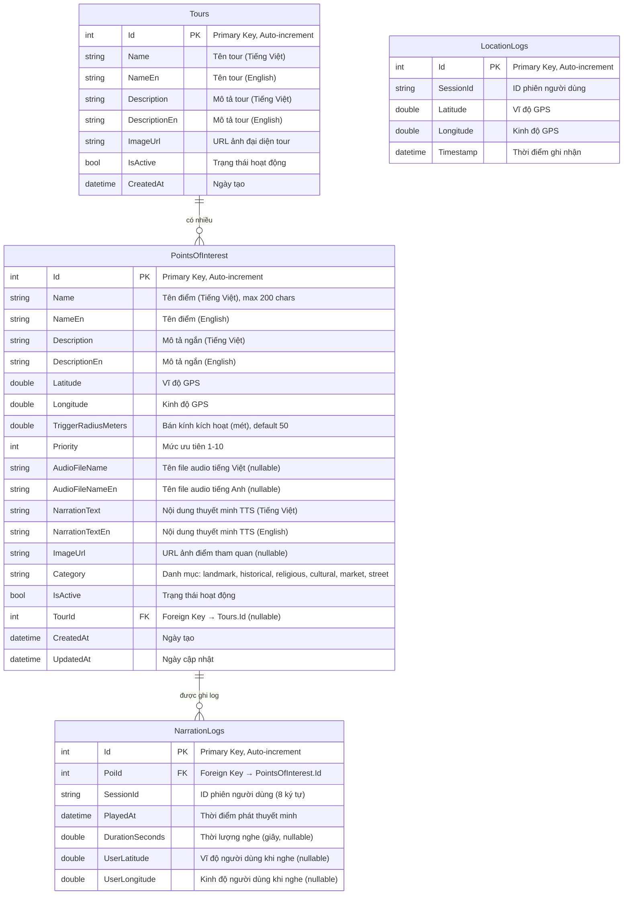
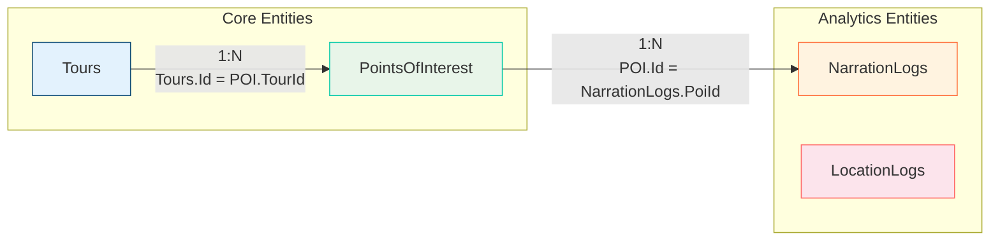
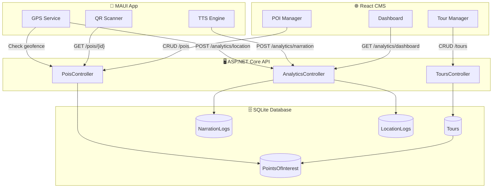

# 📊 Tourist Audio Guide - Entity Relationship Diagram

## Tổng quan Database

Hệ thống sử dụng **SQLite** làm cơ sở dữ liệu, được quản lý bởi **Entity Framework Core**.

---

## 🔑 Giải thích Khóa chính & Khóa ngoại

### Khóa chính (Primary Key - PK)
- **Định nghĩa**: Cột định danh duy nhất cho mỗi bản ghi trong bảng
- **Đặc điểm**: Không được trùng lặp, không được NULL
- **Trong hệ thống này**: Tất cả các bảng đều dùng cột `Id` (kiểu INTEGER, tự động tăng) làm khóa chính

### Khóa ngoại (Foreign Key - FK)
- **Định nghĩa**: Cột tham chiếu đến khóa chính của bảng khác
- **Mục đích**: Tạo liên kết giữa các bảng, đảm bảo tính toàn vẹn dữ liệu
- **Trong hệ thống này**:
  - `PointsOfInterest.TourId` → tham chiếu đến `Tours.Id`
  - `NarrationLogs.PoiId` → tham chiếu đến `PointsOfInterest.Id`

---

## ERD Diagram



---

## Chi tiết các bảng

---

### 1. 🗺️ Tours (Các tour du lịch)

**Mô tả**: Bảng lưu trữ thông tin các tour du lịch. Mỗi tour có thể chứa nhiều điểm tham quan (POI).

| Cột | Kiểu dữ liệu | Ràng buộc | Mô tả chi tiết |
|-----|--------------|-----------|----------------|
| `Id` | INTEGER | **PRIMARY KEY**, AUTO INCREMENT | Mã định danh duy nhất của tour, tự động tăng từ 1 |
| `Name` | TEXT (string) | NOT NULL | Tên tour bằng tiếng Việt. VD: "Tour Quận 1 - TP.HCM" |
| `NameEn` | TEXT (string) | NOT NULL | Tên tour bằng tiếng Anh. VD: "District 1 - HCMC Tour" |
| `Description` | TEXT (string) | | Mô tả chi tiết tour bằng tiếng Việt |
| `DescriptionEn` | TEXT (string) | | Mô tả chi tiết tour bằng tiếng Anh |
| `ImageUrl` | TEXT (string) | NULLABLE | Đường dẫn URL đến ảnh đại diện của tour |
| `IsActive` | INTEGER (bool) | DEFAULT TRUE | Trạng thái: 1 = đang hoạt động, 0 = đã ẩn |
| `CreatedAt` | TEXT (datetime) | | Ngày giờ tạo tour (định dạng UTC) |

**Vai trò trong hệ thống**: Nhóm các POI theo chủ đề, giúp du khách chọn tour phù hợp.

**Seed Data:** 1 tour mặc định "Tour Quận 1 - TP.HCM"

---

### 2. 📍 PointsOfInterest (Các điểm tham quan - POI)

**Mô tả**: Bảng chính lưu trữ thông tin các điểm tham quan. Đây là bảng quan trọng nhất của hệ thống.

| Cột | Kiểu dữ liệu | Ràng buộc | Mô tả chi tiết |
|-----|--------------|-----------|----------------|
| `Id` | INTEGER | **PRIMARY KEY**, AUTO INCREMENT | Mã định danh duy nhất của POI |
| `Name` | TEXT (string) | NOT NULL, MAX 200 ký tự | Tên điểm bằng tiếng Việt. VD: "Nhà thờ Đức Bà Sài Gòn" |
| `NameEn` | TEXT (string) | NOT NULL | Tên điểm bằng tiếng Anh. VD: "Notre-Dame Cathedral" |
| `Description` | TEXT (string) | | Mô tả ngắn gọn về điểm (tiếng Việt) |
| `DescriptionEn` | TEXT (string) | | Mô tả ngắn gọn về điểm (tiếng Anh) |
| `Latitude` | REAL (double) | NOT NULL | **Vĩ độ GPS** - tọa độ Bắc-Nam. VD: 10.7798 (Nhà thờ Đức Bà) |
| `Longitude` | REAL (double) | NOT NULL | **Kinh độ GPS** - tọa độ Đông-Tây. VD: 106.6990 |
| `TriggerRadiusMeters` | REAL (double) | DEFAULT 50 | **Bán kính kích hoạt** (mét): Khi du khách đến gần POI trong phạm vi này, app sẽ tự động phát thuyết minh |
| `Priority` | INTEGER | DEFAULT 1, RANGE 1-10 | **Mức ưu tiên**: Khi du khách đứng trong vùng của nhiều POI cùng lúc, POI có priority cao hơn sẽ được phát trước |
| `AudioFileName` | TEXT (string) | NULLABLE | Tên file audio thuyết minh tiếng Việt (nếu có file ghi âm sẵn) |
| `AudioFileNameEn` | TEXT (string) | NULLABLE | Tên file audio thuyết minh tiếng Anh |
| `NarrationText` | TEXT (string) | | **Nội dung thuyết minh** tiếng Việt - dùng cho Text-to-Speech (TTS) nếu không có file audio |
| `NarrationTextEn` | TEXT (string) | | Nội dung thuyết minh tiếng Anh |
| `ImageUrl` | TEXT (string) | NULLABLE | URL ảnh minh họa cho điểm tham quan |
| `Category` | TEXT (string) | MAX 50, DEFAULT 'landmark' | **Danh mục** phân loại POI |
| `IsActive` | INTEGER (bool) | DEFAULT TRUE | Trạng thái: 1 = hiển thị, 0 = đã ẩn (soft delete) |
| `TourId` | INTEGER | **FOREIGN KEY** → Tours.Id, NULLABLE | **Khóa ngoại** - liên kết POI với Tour. Một POI có thể không thuộc tour nào (NULL) |
| `CreatedAt` | TEXT (datetime) | | Ngày giờ tạo POI |
| `UpdatedAt` | TEXT (datetime) | | Ngày giờ cập nhật gần nhất |

**Giải thích khóa ngoại `TourId`:**
```
PointsOfInterest.TourId ──────────► Tours.Id
         (FK)                         (PK)
         
Ví dụ: POI "Nhà thờ Đức Bà" có TourId = 1
       → Nghĩa là POI này thuộc Tour có Id = 1 ("Tour Quận 1")
```

**Categories hợp lệ:**
| Giá trị | Ý nghĩa |
|---------|---------|
| `landmark` | Địa danh nổi tiếng |
| `historical` | Di tích lịch sử |
| `religious` | Công trình tôn giáo |
| `cultural` | Điểm văn hóa |
| `market` | Chợ, trung tâm mua sắm |
| `street` | Đường phố đặc trưng |

**Seed Data:** 6 POI tại Quận 1, TP.HCM (Nhà thờ Đức Bà, Bưu điện, Dinh Độc Lập, Nhà hát TP, Chợ Bến Thành, Phố đi bộ Nguyễn Huệ)

---

### 3. 🎙️ NarrationLogs (Nhật ký thuyết minh)

**Mô tả**: Bảng ghi lại lịch sử mỗi lần du khách nghe thuyết minh. Dùng để thống kê POI nào được quan tâm nhiều nhất.

| Cột | Kiểu dữ liệu | Ràng buộc | Mô tả chi tiết |
|-----|--------------|-----------|----------------|
| `Id` | INTEGER | **PRIMARY KEY**, AUTO INCREMENT | Mã định danh duy nhất của log |
| `PoiId` | INTEGER | **FOREIGN KEY** → PointsOfInterest.Id | **Khóa ngoại** - POI nào được nghe thuyết minh |
| `SessionId` | TEXT (string) | NULLABLE | ID phiên người dùng (8 ký tự hex). VD: "a1b2c3d4" |
| `PlayedAt` | TEXT (datetime) | DEFAULT NOW | Thời điểm bắt đầu phát thuyết minh |
| `DurationSeconds` | REAL (double) | NULLABLE | Thời gian người dùng nghe (giây). Dùng để biết họ nghe hết hay tắt giữa chừng |
| `UserLatitude` | REAL (double) | NULLABLE | Vĩ độ GPS của người dùng lúc nghe |
| `UserLongitude` | REAL (double) | NULLABLE | Kinh độ GPS của người dùng lúc nghe |

**Giải thích khóa ngoại `PoiId`:**
```
NarrationLogs.PoiId ──────────► PointsOfInterest.Id
        (FK)                           (PK)

Ví dụ: Log có PoiId = 1
       → Nghĩa là người dùng đã nghe thuyết minh POI Id=1 ("Nhà thờ Đức Bà")
```

**Mục đích sử dụng:**
- Thống kê POI nào được nghe nhiều nhất (Top POI)
- Tính thời gian nghe trung bình
- Phân tích hành vi du khách

---

### 4. 📊 LocationLogs (Nhật ký vị trí)

**Mô tả**: Bảng ghi lại vị trí GPS của người dùng theo thời gian. Dùng để tạo heatmap và phân tích đường đi.

| Cột | Kiểu dữ liệu | Ràng buộc | Mô tả chi tiết |
|-----|--------------|-----------|----------------|
| `Id` | INTEGER | **PRIMARY KEY**, AUTO INCREMENT | Mã định danh duy nhất của log |
| `SessionId` | TEXT (string) | NULLABLE | ID phiên người dùng - dùng để nhóm các vị trí của cùng 1 người |
| `Latitude` | REAL (double) | NOT NULL | Vĩ độ GPS tại thời điểm ghi nhận |
| `Longitude` | REAL (double) | NOT NULL | Kinh độ GPS tại thời điểm ghi nhận |
| `Timestamp` | TEXT (datetime) | DEFAULT NOW | Thời điểm ghi nhận vị trí |

**Lưu ý**: Bảng này **KHÔNG có khóa ngoại**. Các log được liên kết với nhau qua `SessionId` (cùng phiên sử dụng).

**Mục đích sử dụng:**
- Tạo **heatmap** (bản đồ nhiệt) - hiển thị vùng nào có nhiều du khách đi qua
- Phân tích **đường đi phổ biến** của du khách
- **Ẩn danh** hoàn toàn - không lưu thông tin cá nhân

---

## 🔗 Sơ đồ quan hệ giữa các bảng



### Giải thích chi tiết các quan hệ:

| Quan hệ | Kiểu | Khóa liên kết | Mô tả |
|---------|------|---------------|-------|
| **Tours → PointsOfInterest** | One-to-Many (1:N) | `Tours.Id` = `PointsOfInterest.TourId` | Một tour có thể chứa **nhiều** điểm tham quan. Một POI chỉ thuộc **một** tour (hoặc không thuộc tour nào) |
| **PointsOfInterest → NarrationLogs** | One-to-Many (1:N) | `PointsOfInterest.Id` = `NarrationLogs.PoiId` | Một POI có thể có **nhiều** lượt nghe thuyết minh. Mỗi log chỉ ghi nhận **một** POI |
| **LocationLogs** | Standalone | Không có FK | Log vị trí độc lập, liên kết logic qua `SessionId` |

### Ví dụ minh họa:

```
┌─────────────────────────────────────────────────────────────────────┐
│                           TOURS                                      │
│  Id=1: "Tour Quận 1 - TP.HCM"                                       │
└─────────────────────────────────────────────────────────────────────┘
         │
         │ (TourId = 1)
         ▼
┌─────────────────────────────────────────────────────────────────────┐
│                      POINTSOFINTEREST                                │
│  Id=1: "Nhà thờ Đức Bà"      (TourId=1)                             │
│  Id=2: "Bưu điện Trung tâm"  (TourId=1)                             │
│  Id=3: "Dinh Độc Lập"        (TourId=1)                             │
└─────────────────────────────────────────────────────────────────────┘
         │
         │ (PoiId = 1, 2, 3)
         ▼
┌─────────────────────────────────────────────────────────────────────┐
│                      NARRATIONLOGS                                   │
│  Id=1: PoiId=1, SessionId="abc123", PlayedAt="2025-01-15 10:30"    │
│  Id=2: PoiId=1, SessionId="xyz789", PlayedAt="2025-01-15 11:00"    │
│  Id=3: PoiId=3, SessionId="abc123", PlayedAt="2025-01-15 10:45"    │
│  → POI "Nhà thờ Đức Bà" (Id=1) có 2 lượt nghe                       │
└─────────────────────────────────────────────────────────────────────┘
```

---

## Indexes & Constraints

```sql
-- Primary Keys (tự động tạo bởi EF Core)
CREATE UNIQUE INDEX "IX_Tours_Id" ON "Tours" ("Id");
CREATE UNIQUE INDEX "IX_PointsOfInterest_Id" ON "PointsOfInterest" ("Id");
CREATE UNIQUE INDEX "IX_NarrationLogs_Id" ON "NarrationLogs" ("Id");
CREATE UNIQUE INDEX "IX_LocationLogs_Id" ON "LocationLogs" ("Id");

-- Foreign Key
CREATE INDEX "IX_PointsOfInterest_TourId" ON "PointsOfInterest" ("TourId");

-- Recommended indexes for analytics queries
CREATE INDEX "IX_NarrationLogs_PoiId" ON "NarrationLogs" ("PoiId");
CREATE INDEX "IX_NarrationLogs_SessionId" ON "NarrationLogs" ("SessionId");
CREATE INDEX "IX_LocationLogs_SessionId" ON "LocationLogs" ("SessionId");
CREATE INDEX "IX_LocationLogs_Coords" ON "LocationLogs" ("Latitude", "Longitude");
```

---

## Data Flow Diagram



---

## Session ID Format

```
SessionId = Guid.NewGuid().ToString("N")[..8]
Ví dụ: "a1b2c3d4"
```

- Tạo mới mỗi khi app khởi động
- Dùng để nhóm các log của cùng một phiên sử dụng
- **Ẩn danh** - không chứa thông tin cá nhân

---

## API Endpoints liên quan Database

| Method | Endpoint | Table(s) | Mô tả |
|--------|----------|----------|-------|
| GET | `/api/pois` | PointsOfInterest | Lấy tất cả POI active |
| GET | `/api/pois/{id}` | PointsOfInterest | Lấy POI theo ID |
| GET | `/api/pois/tour/{tourId}` | PointsOfInterest | Lấy POI theo Tour |
| POST | `/api/pois` | PointsOfInterest | Tạo POI mới |
| PUT | `/api/pois/{id}` | PointsOfInterest | Cập nhật POI |
| DELETE | `/api/pois/{id}` | PointsOfInterest | Soft delete POI |
| GET | `/api/tours` | Tours, PointsOfInterest | Lấy tất cả tour với POI |
| GET | `/api/tours/{id}` | Tours, PointsOfInterest | Lấy tour theo ID |
| POST | `/api/tours` | Tours | Tạo tour mới |
| PUT | `/api/tours/{id}` | Tours | Cập nhật tour |
| DELETE | `/api/tours/{id}` | Tours | Soft delete tour |
| POST | `/api/analytics/narration` | NarrationLogs | Ghi log thuyết minh |
| POST | `/api/analytics/location` | LocationLogs | Ghi log vị trí |
| POST | `/api/analytics/locations/batch` | LocationLogs | Ghi batch vị trí |
| GET | `/api/analytics/dashboard` | All tables | Lấy thống kê tổng hợp |

---

## Ghi chú kỹ thuật

1. **Soft Delete**: POI và Tour không bị xóa vật lý, chỉ set `IsActive = false`
2. **Cascade**: Khi xóa Tour, các POI thuộc tour đó vẫn tồn tại (TourId nullable)
3. **UTC Time**: Tất cả datetime được lưu ở UTC
4. **Multi-language**: Hỗ trợ song ngữ Việt-Anh cho name, description, narration
5. **Audio Priority**: Nếu có `AudioFileName` → phát file audio, không có → dùng TTS với `NarrationText`
